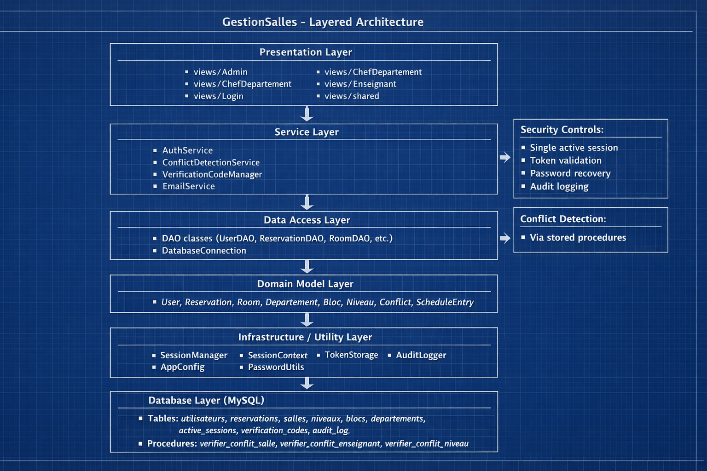

# GestionSalles

GestionSalles is a Java desktop platform for university room governance, reservation scheduling, and role-scoped academic operations.

## Overview

The system centralizes room allocation and scheduling workflows for three roles:

- `Admin`
- `Chef_Departement`
- `Enseignant`

It provides:

- Conflict-aware reservation management
- Role-scoped dashboards and schedule views
- Organizational data management (departments, blocs, levels, rooms, users)
- Authentication, password recovery, and session-security controls
- Audit/operational activity visibility

## Architecture Summary

GestionSalles uses a layered architecture:

1. Presentation layer: `views/*`
2. Service layer: `services/*`
3. Data access layer: `dao/*`, `database/*`
4. Domain layer: `models/*`
5. Infrastructure layer: `utils/*`
6. SQL/schema layer: `db/*`

## Security Highlights

- Single active session policy per user
- Session revalidation and forced logout on invalid session
- Verification-code based password recovery with expiry controls
- Environment-first secret/config handling with hardening checks
- Security-sensitive event auditing

## Screenshots

### Login

### Admin Dashboard

### Reservation Management

### Schedule Viewer

### Layered Architecture

## Full Technical Reference

For complete product, UX, architecture, and implementation details, see:

- `APP_FULL_REFERENCE.md`
- `docs/security-and-session.md`
- `docs/database.md`
- `docs/packaging.md`

## Repository Structure

- `src/main/java/com/gestion/salles`: application source code
- `src/main/resources`: resources and runtime scripts
- `src/test/java/com/gestion/salles`: tests
- `db/`: schema, migration, and seed SQL assets
- `docs/`: technical documentation

## Intellectual Property

Copyright (c) 2026 Abdelrahman Benmoulai.
All rights reserved.

This repository is published for documentation and evaluation purposes only. No permission is granted to copy, reuse, modify, redistribute, or integrate this codebase without explicit prior written authorization from the author.
