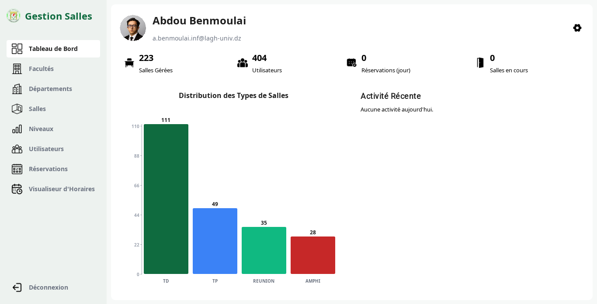

# GestionSalles

Java desktop application for managing university room reservations, schedules, users, and conflict-free allocation.

## Features

- Role-based dashboards (`Admin`, `Chef Departement`, `Enseignant`)
- Room reservation and schedule management
- Conflict detection for overlapping reservations
- User, department, bloc, and level management
- Authentication, remember-me sessions, and password recovery
- Audit/security-oriented session handling

## Tech Stack

- Java 17
- Maven
- MySQL
- Swing (desktop UI)

## Prerequisites

- JDK 17+
- Maven 3.8+
- MySQL 8+

## Configuration

The app expects database/email settings from environment variables (preferred) with placeholders in resource files.

Required environment variables:

- `DB_URL` (optional if using default in properties)
- `DB_USER`
- `DB_PASSWORD`
- `GESTION_SALLES_EMAIL_SENDER`
- `GESTION_SALLES_EMAIL_APP_PASSWORD`
- `GESTION_SALLES_SECRET` (recommended)

See docs for details:

- `docs/database.md`
- `docs/security-and-session.md`
- `docs/packaging.md`

## Database Setup

Create and initialize the database using one of these:

- `db/schema.sql`
- `gestion_salles.sql`

Optional seed data:

- `db/seed/minimal_seed.sql`

## Build and Run

Build:

```bash
mvn clean package
```

Run tests:

```bash
mvn test
```

Run app (from Maven):

```bash
mvn exec:java -Dexec.mainClass="com.gestion.salles.MainApp"
```

If you package/distribute, see scripts and packaging docs:

- `src/main/resources/scripts/gestionsalles.sh`
- `scripts/health-check.sh`
- `src/main/assembly/zip.xml`

## Screenshots

Place screenshots in `docs/screenshots/` using these filenames:

- `login.png`
- `admin-dashboard.png`
- `reservation-management.png`
- `schedule-view.png`

Then they will render automatically below:

### Login


### Admin Dashboard



### Reservation Management


### Schedule View


## Project Structure

```text
src/main/java/com/gestion/salles
  ├── dao
  ├── database
  ├── models
  ├── services
  ├── utils
  └── views
src/main/resources
db/
docs/
```

## Notes

- Do not commit local runtime artifacts (`target/`, `logs/`, `uploads/`, local profile pictures).
- `.gitignore` is already configured for first-commit safety.
